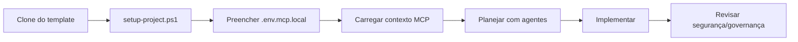

# default-template-ai-projects

<p align="center">
  <a href="#"></a>
  <a href="#"></a>
  <a href="#"></a>
  <a href="#"></a>
</p>

Template governado e AI-first para iniciar projetos com produtividade alta, qualidade de código, CI/CD automatizado, IaC e contexto operacional para IDEs com IA.

> [!IMPORTANT]
> Este template força o fluxo correto: **primeiro planejar com contexto, depois implementar**.

## 📌 Navegação rápida
- [✨ O que este template entrega](#-o-que-este-template-entrega)
- [🎬 Demo rápida (30 segundos)](#-demo-rápida-30-segundos)
- [🚀 Início rápido (para iniciantes)](#-início-rápido-para-iniciantes)
- [🧠 Prompt inicial recomendado para a IA](#-prompt-inicial-recomendado-para-a-ia)
- [🔌 MCP e personalização por projeto](#-mcp-e-personalização-por-projeto)
- [🤖 Fluxo padrão de agentes](#-fluxo-padrão-de-agentes)
- [🛡️ Governança obrigatória](#️-governança-obrigatória)
- [✅ Qualidade, CI/CD e segurança](#-qualidade-cicd-e-segurança)
- [❓ FAQ (iniciantes)](#-faq-iniciantes)

## ✨ O que este template entrega
- Estrutura única para Python, R/Posit e Rust.
- Governança obrigatória desde o primeiro commit.
- Compatibilidade com IDEs com IA (Cursor, VS Code/Copilot, Zed, Trae, Replit).
- CI/CD e segurança já preparados.
- MCP para Jira, Azure DevOps, Figma e Notion.
- Bootstrap guiado com `PROJECT_NAME` obrigatório por projeto.

## 🧭 Fluxo visual (simples)


## 🎬 Demo rápida (30 segundos)
```bash
git clone https://github.com/BettoEsteves/default-template-ai-projects.git
cd default-template-ai-projects
pwsh -File infra/ci/setup-project.ps1
docker compose --env-file .env.mcp.local -f infra/ci/docker-compose.mcp.yml up -d
```

> [!NOTE]
> Para adicionar um GIF de demonstração no futuro, basta inserir o link logo abaixo desta seção (ex.: gravação curta do fluxo acima).

## 🚀 Início rápido (para iniciantes)
1. Clone e abra o repositório na sua IDE com IA.
2. Execute o bootstrap:
	- `pwsh -File infra/ci/setup-project.ps1`
3. Informe um `PROJECT_NAME` real (obrigatório em cada novo projeto).
4. Complete os campos pendentes no `.env.mcp.local`.
5. (Opcional) Suba MCP via Docker:
	- `docker compose --env-file .env.mcp.local -f infra/ci/docker-compose.mcp.yml up -d`
6. Leia os arquivos de governança nesta ordem:
	- `.ai/PROJECT_STRUCTURE.md`
	- `.ai/AGENT_CONTRACT.md`
	- `.ai/rules.md`
	- `.ai/STRUCTURE_CHECKLIST.md`
7. Peça para a IA **planejar primeiro**. Só depois aprove implementação.

> [!TIP]
> Se você só fizer 1 coisa após clonar: rode `infra/ci/setup-project.ps1`.

## 🧠 Prompt inicial recomendado para a IA
Use este prompt no primeiro comando da IDE:

"Leia e aplique como contexto obrigatório: `.ai/PROJECT_STRUCTURE.md`, `.ai/AGENT_CONTRACT.md`, `.ai/rules.md`, `.ai/STRUCTURE_CHECKLIST.md`, `docs/TEMPLATE_USAGE.md`, `docs/VibeCodingAgent.md`, `docs/MCP_Jira_Azure_Setup.md`. Em seguida, carregue contexto de Jira/Azure/Figma/Notion via MCP, proponha plano de execução com critérios de aceite, riscos e validação. Não implemente código antes da aprovação do plano."

## 🔌 MCP e personalização por projeto
Cada projeto deve ter sua própria identidade e credenciais:
- `PROJECT_NAME` obrigatório no `.env.mcp.local`
- Tokens e identificadores MCP por usuário/time
- `.env.mcp.local` **não é versionado**

Arquivos principais:
- `.env.mcp.example` (template de variáveis)
- `.cursor/mcp.json` (bindings MCP no workspace)
- `infra/ci/setup-project.ps1` (gera e valida configuração local)
- `infra/ci/docker-compose.mcp.yml` (MCP containerizado)

## 🤖 Fluxo padrão de agentes
1. Carregar contexto de work items:
	- `.github/agents/jira-workflow.agent.md`
	- `.github/agents/azure-devops-workflow.agent.md`
2. Carregar contexto de design/documentação (Figma/Notion via MCP).
3. Planejar com `.github/agents/task-planner.agent.md`.
4. Implementar com `.github/agents/swe-implementer.agent.md`.
5. Revisar segurança com `.github/agents/security-reviewer.agent.md`.
6. Para IaC, usar também `.github/agents/terraform-iac-reviewer.agent.md`.

## 🛡️ Governança obrigatória
Arquivos mandatórios:
- `.ai/PROJECT_STRUCTURE.md`
- `.ai/AGENT_CONTRACT.md`
- `.ai/rules.md`
- `.ai/STRUCTURE_CHECKLIST.md`

Regras essenciais:
- Não criar arquivos fora da estrutura governada sem atualização formal.
- Não versionar `results/`, `logs/` e `tests/scripts/`.
- Atualizar documentação/checklist quando mudar comportamento, política ou estrutura.

## ✅ Qualidade, CI/CD e segurança
- Workflow principal: `.github/workflows/ci.yml`
- Workflow de segurança: `.github/workflows/security.yml`
- Terraform baseline: `fmt`, `init -backend=false`, `validate`
- Testes Python: `unit`, `integration`, `e2e`
- Dependências: `.github/dependabot.yml`
- Segurança: `pip-audit`, `detect-secrets`, `CodeQL`

## 🧪 Comandos úteis
- Validar bootstrap local: `pwsh -File infra/ci/setup-project.ps1`
- Subir MCP no Docker: `docker compose --env-file .env.mcp.local -f infra/ci/docker-compose.mcp.yml up -d`
- Parar MCP no Docker: `docker compose --env-file .env.mcp.local -f infra/ci/docker-compose.mcp.yml down`
- Rodar testes Python (sem e2e): `pytest -m "not e2e"`
- Rodar validação Terraform: `terraform -chdir=infra/terraform fmt -check -recursive && terraform -chdir=infra/terraform init -backend=false && terraform -chdir=infra/terraform validate`

## 📚 Guias úteis
- `docs/TEMPLATE_USAGE.md`
- `docs/Cursor_Context.md`
- `docs/IDE_Context_Matrix.md`
- `docs/VibeCodingAgent.md`
- `docs/MCP_Jira_Azure_Setup.md`
- `docs/Productivity_CI_Playbook.md`
- `docs/GitHubFlow.md`
- `docs/PyCharm.md`

## 🧾 Políticas do repositório
- `CONTRIBUTING.md`
- `SECURITY.md`
- `CODE_OF_CONDUCT.md`
- `SUPPORT.md`
- `.github/CODEOWNERS`
- `.github/pull_request_template.md`

## 🎯 Resultado esperado
Ao clonar este template, qualquer IDE com IA deve conseguir:
- carregar contexto certo desde o início,
- planejar antes de codar,
- personalizar variáveis do projeto com segurança,
- executar com padrão consistente de governança,
- validar tudo com CI, segurança e IaC.

## ❓ FAQ (iniciantes)
**1) Preciso editar arquivo manualmente antes de começar?**
- Só o `.env.mcp.local` (gerado pelo script). O restante já vem preparado.

**2) O `PROJECT_NAME` é obrigatório mesmo?**
- Sim. Cada novo projeto deve ter um nome próprio para contexto, rastreabilidade e integração MCP.

**3) Se eu não usar Docker, consigo usar o template?**
- Sim. Docker para MCP é opcional; você pode usar endpoints remotos no `.cursor/mcp.json`.

**4) Posso pedir código para a IA imediatamente?**
- Não é recomendado. Primeiro peça plano com critérios de aceite e riscos.

---

# 🇺🇸 English Version

Governed, AI-first template to kickstart projects with high productivity, code quality, CI/CD automation, IaC, and MCP-enabled IDE context.

> [!IMPORTANT]
> This template enforces the right flow: **plan with context first, then implement**.

## 📌 Quick Navigation (EN)
- [✨ What this template provides](#-what-this-template-provides)
- [🎬 30-second demo](#-30-second-demo)
- [🚀 Quickstart (beginners)](#-quickstart-beginners)
- [🧠 Recommended first AI prompt](#-recommended-first-ai-prompt)
- [🔌 MCP and project customization](#-mcp-and-project-customization)
- [🤖 Standard agent workflow](#-standard-agent-workflow)
- [🛡️ Mandatory governance](#️-mandatory-governance)
- [✅ Quality, CI/CD, and security](#-quality-cicd-and-security)
- [❓ FAQ (beginners)](#-faq-beginners)

## ✨ What this template provides
- A single structure for Python, R/Posit, and Rust.
- Governance from day zero.
- Compatibility with AI IDEs (Cursor, VS Code/Copilot, Zed, Trae, Replit).
- CI/CD and security baseline already prepared.
- MCP integrations for Jira, Azure DevOps, Figma, and Notion.
- Guided bootstrap with mandatory `PROJECT_NAME` per project.

## 🎬 30-second demo
```bash
git clone https://github.com/BettoEsteves/default-template-ai-projects.git
cd default-template-ai-projects
pwsh -File infra/ci/setup-project.ps1
docker compose --env-file .env.mcp.local -f infra/ci/docker-compose.mcp.yml up -d
```

## 🚀 Quickstart (beginners)
1. Clone and open the repository in your AI IDE.
2. Run bootstrap:
  - `pwsh -File infra/ci/setup-project.ps1`
3. Provide a real `PROJECT_NAME` (required for every new cloned project).
4. Fill remaining values in `.env.mcp.local`.
5. (Optional) Start MCP with Docker:
  - `docker compose --env-file .env.mcp.local -f infra/ci/docker-compose.mcp.yml up -d`
6. Read governance files in this order:
  - `.ai/PROJECT_STRUCTURE.md`
  - `.ai/AGENT_CONTRACT.md`
  - `.ai/rules.md`
  - `.ai/STRUCTURE_CHECKLIST.md`
7. Ask AI to **plan first**. Approve the plan before implementation.

## 🧠 Recommended first AI prompt
Use this as your first IDE prompt:

"Read and apply the following as mandatory context: `.ai/PROJECT_STRUCTURE.md`, `.ai/AGENT_CONTRACT.md`, `.ai/rules.md`, `.ai/STRUCTURE_CHECKLIST.md`, `docs/TEMPLATE_USAGE.md`, `docs/VibeCodingAgent.md`, `docs/MCP_Jira_Azure_Setup.md`. Then load Jira/Azure/Figma/Notion context through MCP, propose an execution plan with acceptance criteria, risks, and validation. Do not implement code before plan approval."

## 🔌 MCP and project customization
Each project should have its own identity and credentials:
- Mandatory `PROJECT_NAME` in `.env.mcp.local`
- MCP tokens and identifiers per user/team
- `.env.mcp.local` is **not versioned**

Key files:
- `.env.mcp.example` (variables template)
- `.cursor/mcp.json` (workspace MCP bindings)
- `infra/ci/setup-project.ps1` (generates and validates local config)
- `infra/ci/docker-compose.mcp.yml` (containerized MCP)

## 🤖 Standard agent workflow
1. Load work-item context:
  - `.github/agents/jira-workflow.agent.md`
  - `.github/agents/azure-devops-workflow.agent.md`
2. Load design/documentation context (Figma/Notion via MCP).
3. Plan with `.github/agents/task-planner.agent.md`.
4. Implement with `.github/agents/swe-implementer.agent.md`.
5. Run security review with `.github/agents/security-reviewer.agent.md`.
6. For IaC scope, also use `.github/agents/terraform-iac-reviewer.agent.md`.

## 🛡️ Mandatory governance
Mandatory files:
- `.ai/PROJECT_STRUCTURE.md`
- `.ai/AGENT_CONTRACT.md`
- `.ai/rules.md`
- `.ai/STRUCTURE_CHECKLIST.md`

Essential rules:
- Do not create files outside governed structure without formal update.
- Do not track `results/`, `logs/`, or `tests/scripts/`.
- Update docs/checklist when behavior, policy, or structure changes.

## ✅ Quality, CI/CD, and security
- Main workflow: `.github/workflows/ci.yml`
- Security workflow: `.github/workflows/security.yml`
- Terraform baseline: `fmt`, `init -backend=false`, `validate`
- Python tests: `unit`, `integration`, `e2e`
- Dependency automation: `.github/dependabot.yml`
- Security tooling: `pip-audit`, `detect-secrets`, `CodeQL`

## ❓ FAQ (beginners)
**1) Do I need to manually edit files before starting?**
- Only `.env.mcp.local` (generated by script). Everything else is already prepared.

**2) Is `PROJECT_NAME` really mandatory?**
- Yes. Every new project should define its own name for context, traceability, and MCP integration.

**3) Can I use this template without Docker?**
- Yes. Docker for MCP is optional; you can use remote MCP endpoints in `.cursor/mcp.json`.

**4) Can I ask AI to code immediately?**
- Not recommended. Ask for a plan with acceptance criteria and risks first.
